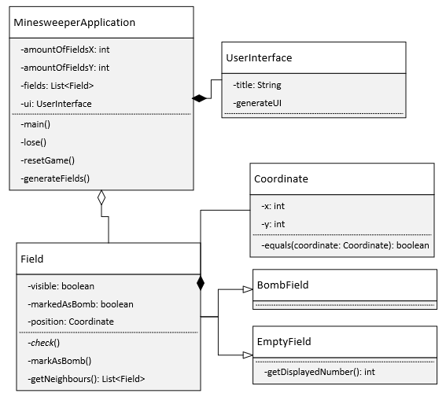

# Projektdokumentation

## Minesweeper

Wir haben und dieses Mal wieder dazu entschieden ein kleines Spiel zu programmieren und es handelt sich dabei,
um das alt bekannte Minesweeper. Die Regeln sind genau gleich wie beim Normalen spiel, mann kann sogar Felder flaggen.

Natürlich brauchen wir auch dafür wieder ein GUI das wir mit Java Swing umgesetzt haben.
Der ganze code ist wie auch schon zuvor in Java ohne zusätzliche Frameworks.

## Klassen Diagramm:

Das Klassendiagramm ist ziemlich simple wir haben einfach eine Klasse die das ganze GUI erstellt
und das Verhalten der Buttons regelt. Dann haben wir die Applikation also die Main Klasse,
welche den grössten der Logik abwickelt und statisch ist.

Dann kommt die Abstrakte Field Klasse, welche jeweils eine Koordinate hat, damit die Position jedes Feldes angegeben werden kann.
Dazu kommen dann die zwei unter Klassen das EmtpyField und das BombField.

## Selbstreflexion:
Es gibt eigentlich nicht viel zu Sagen das Projekt lief einwandfrei ab, die Arbeitsteilung war von anfang an klar
und wir konnten loslegen, sobald uns eine gute Idee einfiel.
Die Teamarbeit funktioniert immer noch sehr gut, da wir schon etliche Projekte zusammen abgeschlossen haben.

